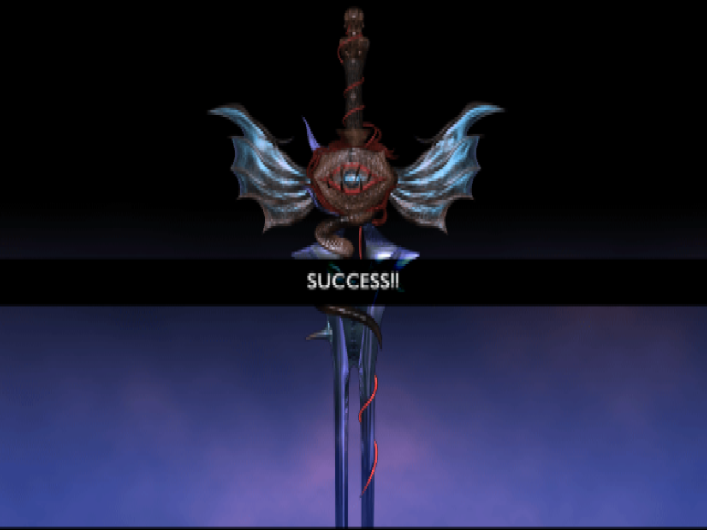
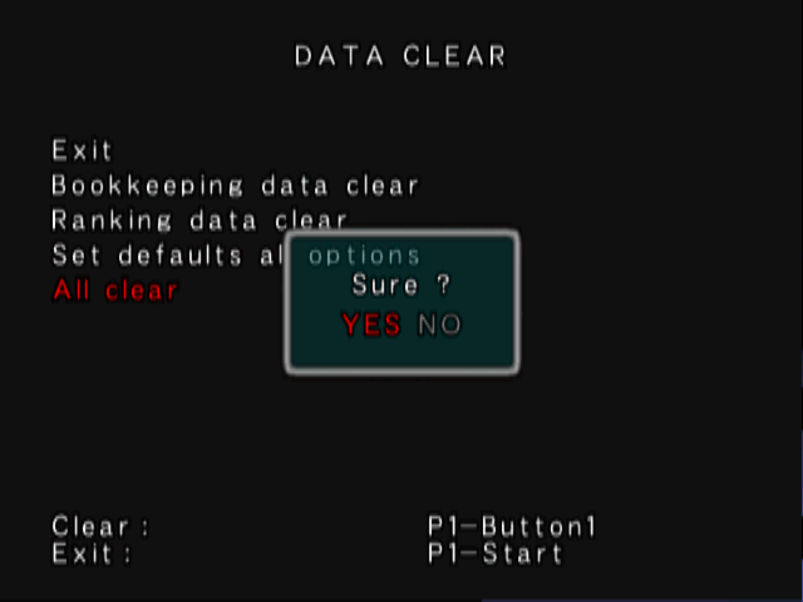

# how to format SoulCalibur2 Conquest Card

Given SoulCalibur2 is the only one to ever use the second memory card port, and having a special format for it... a dedicated page for it was fitting...

You should create a raw dump with ECC of the conquest card, just like how you would with a security dongle. just remember the conquest card does not have a normal PS2 filesystem

after you have it, you need to set it up on the emulator. for the .acgame config file for your soulcalibur2 game, add the following line on the `data` section

```ini
card=Card0.conquestcard
```

!!! note

    PCSX2x6 has been made capable of reading memory card images with `.conquestcard` extension, to ensure any filesystem tweaking PCSX2 could do is not applied to the conquest card (since those operations rely on file extension to be done or not)

once you have it, you should be able to run the game and it should accept the conquest card image on the initial check...

{ width="300" }
/// caption
Conquest card accepted
///

after that, you must enter TESTMODE and select the **DATA CLEAR** > **Clear All** option... like this:

{ width="300" }
/// caption
Conquest card format schedule
///


!!! warning

    what this option does is cleanup all settings and schedule a conquest card format for the following reboot (which should happen by pressing exit and save)
    Remember to change back all desired settings, such as FreePlay or Difficulty!


after the format is complete (you should see a "now saving"text on top of the screen where conquest card is checked.) the conquest card is ready

if you don't do this step, conquest card will have invalid encryption for player data and therefore will hang on a white screen while loading into your first match